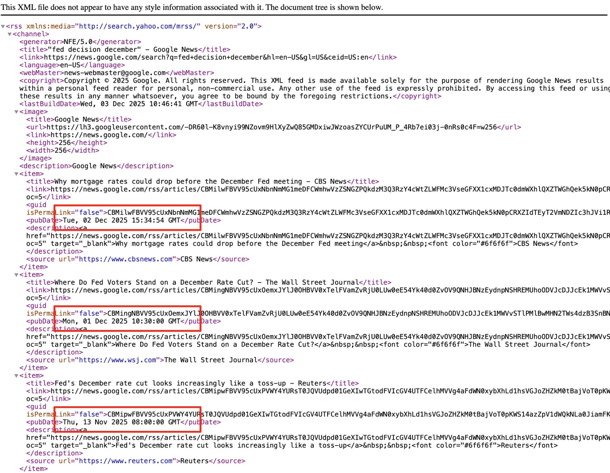
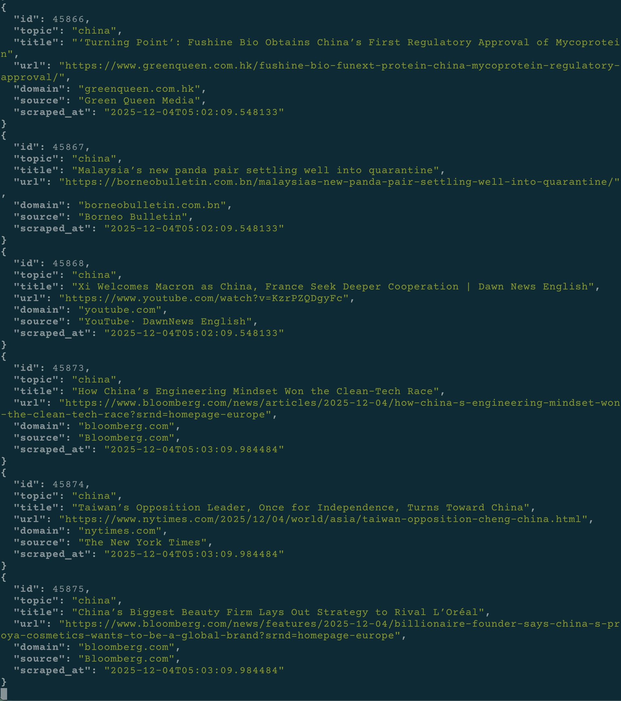
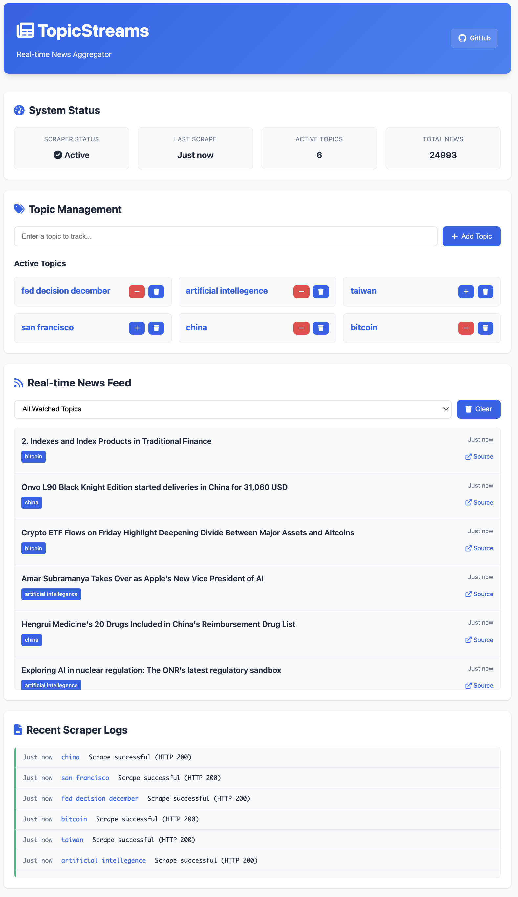

# TopicStreams

Real-time news aggregation system that continuously scrapes Google (not Google News) for any topics (search keywords) and streams updates via WebSocket.

## Why TopicStreams?

### The Limitations with Google News & RSS

Google News ([https://news.google.com](https://news.google.com)) and Google News RSS (`https://news.google.com/rss?search=<keyword>`) provide curated news collections based on Google's algorithms. While convenient, they have limitations:

- Results are **not necessarily the latest** - articles may be hours or days old
- Google filters by **quality and relevance**, potentially missing breaking news
- No control over what Google considers "newsworthy"

<p align="center">
<br/>
<em>Google News Search result - hours or days old</em>
</p>

<p align="center">
<br/>
<em>Google News RSS - same as Google News search</em>
</p>

### TopicStreams' Approach

TopicStreams scrapes **Google Search → News Tab** with time filters, giving you:

- **Real-time results** - All news indexed by Google, regardless of quality rating
- **Unfiltered access** - No curation, you decide what's relevant
- **Near-instant updates** - Scrape frequently enough and catch news as it breaks
- **Full control** - Customize topics (search keywords) and scrape intervals

<p align="center">
<br/>
<em>Google Search News Tab - Latest, Unfiltered Results</em>
</p>

## Try It Live

**Experience TopicStreams in action**: [http://topicstreams.dongziyu.com:8080](http://topicstreams.dongziyu.com:8080)

### Quick Demo

```bash
# Add topics (ensure they exist)
curl -X POST http://topicstreams.dongziyu.com:8080/api/v1/topics \
  -H "Content-Type: application/json" \
  -d '{"name": "Bitcoin"}'

# List all active topics (contain "bitcoin")
curl http://topicstreams.dongziyu.com:8080/api/v1/topics | jq

# Get latest news for "Bitcoin"
curl http://topicstreams.dongziyu.com:8080/api/v1/news/bitcoin?limit=5 | jq
```

### WebSocket Streaming

For real-time news updates, connect via WebSocket:

```bash
# Real-time WebSocket news stream for "China" (automatically add topic if not present)
websocat ws://topicstreams.dongziyu.com:8080/api/v1/ws/news/china | jq
```

The WebSocket delivers live news updates as they're scraped, showing the same content you'd see by continuously refreshing Google's news search page.

<p align="center">
<br/>
<em>WebSocket Real-time News Stream - Live updates as articles are scraped</em>
</p>

### What TopicStreams Offers

- **Real-time news streaming** on customizable topics (any search keywords)
- **Self-hosted** - No third-party news API costs

### Limitations

- **Google Dependency** - Black box algorithms, no source control, variable indexing speed, geographic filtering
- **Inconsistent Results** - Same queries return different results based on IP, geolocation, browser, A/B testing
- **No Quality Control** - All news included, credible or not
- **Access Risks** - Google may detect scraping and rate limit or block access, mitigation: [anti-bot detection](#anti-bot-detection)

## Features

- **Real-time News Aggregation** - Continuously scrapes Google Search News tab (not Google News site) for the latest articles
- **Multi-Topic Tracking** - Monitor multiple news topics simultaneously with configurable scrape intervals
- **WebSocket Streaming** - Subscribe to live news updates per topic via WebSocket connections
- **REST API** - Manage topics and retrieve historical news entries through HTTP endpoints
- **Anti-Bot Detection** - Playwright with stealth patches, realistic browser fingerprinting, and configurable geolocation ([details](#anti-bot-detection))

## Architecture

TopicStreams consists of three main components:

```plaintext
┌─────────────────────────┐
│         Client          │
│ (REST API / WebSocket)  │
└────────────┬────────────┘
             │                               
             ▼                               
┌─────────────────────────┐    ┌──────────────────────────────┐
│     FastAPI Server      │    │      Scraper Service         │
│                         │    │                              │
│  - REST endpoints       │    │  - Playwright browser        │
│  - WebSocket streams    │    │  - BeautifulSoup parser      │
│  - PostgreSQL listener  │    │  - Continuous scraping loop  │
└────────────┬────────────┘    └─────────────┬────────────────┘
             │                               │
             ▼                               ▼
┌─────────────────────────────────────────────────────────────┐
│                   PostgreSQL Database                       │
│                                                             │
│          - Topics (tracked keywords)                        │
│          - News Entries (scraped articles)                  │
│          - Scraper Logs (monitoring)                        │
│          - LISTEN/NOTIFY for real-time updates              │
└─────────────────────────────────────────────────────────────┘
```

### Data Flow

1. **Scraper Service** continuously scrapes Google Search News tab for tracked topics
2. New articles are inserted into **PostgreSQL** with automatic deduplication
3. Database triggers send **NOTIFY** events on new inserts
4. **FastAPI Server** listens for these events via PostgreSQL's LISTEN/NOTIFY
5. Updates are pushed to connected **WebSocket clients** in real-time
6. Clients can also fetch historical data via **REST API**

### Key Technologies

- **FastAPI** - Web framework for REST and WebSocket
- **Playwright** - Browser automation with anti-bot detection ([see how it works](#anti-bot-detection))
- **PostgreSQL** - Reliable storage with LISTEN/NOTIFY for real-time events
- **Docker** - Container orchestration for easy deployment

## Prerequisites

- **Docker** installed on your system
  - [Install Docker](https://docs.docker.com/get-docker/)

That's it! All dependencies (Python, PostgreSQL, Playwright browsers) are handled inside containers.

> **Optional:** Install [websocat](https://github.com/vi/websocat) for WebSocket testing (used for demo in this article), or use any WebSocket client you prefer.

## Web UI

TopicStreams includes a modern, responsive Web UI that provides a complete dashboard for monitoring and managing your news aggregation system.

### Features

- **System Status Dashboard** - Real-time monitoring of scraper health and activity
- **Topic Management** - Easy add/remove topics with visual feedback
- **Real-time News Feed** - Live updates with WebSocket connections
- **Scraper Logs Panel** - Historical activity monitoring

### Access the Web UI

After [Quick Start](#quick-start), simply open your browser and navigate to:

```plaintext
http://localhost:5000
```

<p align="center">

<br/>
<em>TopicStreams Web UI - Complete dashboard for real-time news aggregation</em>
</p>

## Quick Start

### 1. Clone the Repository

```bash
git clone https://github.com/zydo/topicstreams.git
cd topicstreams
```

### 2. Configure Environment

Copy `.env.example` to `.env` and customize if needed:

```bash
cp .env.example .env
```

Default settings work out-of-the-box.

### 3. Start Services

```bash
docker compose up -d
```

This will start three containers:

- **postgres** - Database
- **scraper** - Background scraping service
- **api** - FastAPI server [http://localhost:5000](http://localhost:5000)

### 4. Add Topics to Track

```bash
# Add a topic
curl -X POST http://localhost:5000/api/v1/topics \
  -H "Content-Type: application/json" \
  -d '{"name": "artificial intelligence"}'
```

Scraping of the topic will start on the next iteration.

### 5. Access Real-Time News

**WebSocket (for real-time):**

```bash
# Using websocat
websocat ws://localhost:5000/api/v1/ws/news/artificial+intelligence

# Or with jq for prettier formatted output
websocat ws://localhost:5000/api/v1/ws/news/artificial+intelligence | jq
```

**REST API (for historical data):**

```bash
# Get recent news for a topic with pagination (result 11 to 15, newest first)
curl http://localhost:5000/api/v1/news/artificial+intelligence?offset=10&limit=5 | jq

# List all actively scraping topics
curl http://localhost:5000/api/v1/topics | jq

# List recent 10 scraper logs (each log represents one Google webpage load - typically up to 10 news entries)
curl http://localhost:5000/api/v1/logs?limit=10 | jq
```

See the [API Reference](#api-reference) section below for complete endpoint documentation.

### 6. Monitor Logs

```bash
# Background scraper logs
docker compose logs -f scraper

# FastAPI server logs
docker compose logs -f api
```

### Stop Services

```bash
docker compose down
```

## Configuration

All configuration is done via environment variables in the `.env` file. Copy `.env.example` to get started.

### Database Settings

| Variable            | Default    | Description                                                                                    |
| ------------------- | ---------- | ---------------------------------------------------------------------------------------------- |
| `POSTGRES_HOST`     | `postgres` | PostgreSQL hostname (use Docker service name, `postgres`, for Docker services internal access) |
| `POSTGRES_PORT`     | `5432`     | PostgreSQL port                                                                                |
| `POSTGRES_DB`       | `newsdb`   | Database name                                                                                  |
| `POSTGRES_USER`     | `newsuser` | Database username                                                                              |
| `POSTGRES_PASSWORD` | `newspass` | Database password                                                                              |

> **Note:** The PostgreSQL service is only accessible within the Docker network (not exposed to the host). Simple passwords are acceptable since the database is not publicly accessible. For direct database access, see [Database Access](#database-access).

### API Settings

| Variable   | Default | Description             |
| ---------- | ------- | ----------------------- |
| `API_PORT` | `5000`  | Port for FastAPI server |

> **Note:** The API port is mapped to the same port on the host (Docker internal `5000` → host `localhost:5000`). If port `5000` is already in use on your host, modify the port mapping in `docker-compose.yml` (e.g., change `"5000:5000"` to `"8000:5000"` to access via `localhost:8000`).

### Scraper Settings

| Variable          | Default | Description                                                                                                                                                                                        |
| ----------------- | ------- | -------------------------------------------------------------------------------------------------------------------------------------------------------------------------------------------------- |
| `SCRAPE_INTERVAL` | `60`    | Interval in seconds between scrape cycles (measured from start to start). Set to `0` or negative for continuous scraping with no delay. See [Scrape Interval Behavior](#scrape-interval-behavior). |
| `MAX_PAGES`       | `1`     | Number of result pages to scrape. Increase if you have high-volume topics or longer intervals.                                                                                                     |

### Browser Fingerprinting (Anti-Detection)

| Variable                        | Default               | Description                                                                                                                                                                       |
| ------------------------------- | --------------------- | --------------------------------------------------------------------------------------------------------------------------------------------------------------------------------- |
| `BROWSER_TIMEZONE`              | `America/Los_Angeles` | Browser timezone identifier. Recommended to match your machine's IP location to be "realistic". [List of timezones](https://en.wikipedia.org/wiki/List_of_tz_database_time_zones) |
| `BROWSER_GEOLOCATION_LATITUDE`  | `37.3273`             | Latitude coordinate (default: San Jose, CA)                                                                                                                                       |
| `BROWSER_GEOLOCATION_LONGITUDE` | `-121.954`            | Longitude coordinate (default: San Jose, CA)                                                                                                                                      |

**Example configurations:**

```bash
# New York
BROWSER_TIMEZONE=America/New_York
BROWSER_GEOLOCATION_LATITUDE=40.7128
BROWSER_GEOLOCATION_LONGITUDE=-74.0060

# London
BROWSER_TIMEZONE=Europe/London
BROWSER_GEOLOCATION_LATITUDE=51.5074
BROWSER_GEOLOCATION_LONGITUDE=-0.1278

# Tokyo
BROWSER_TIMEZONE=Asia/Tokyo
BROWSER_GEOLOCATION_LATITUDE=35.6762
BROWSER_GEOLOCATION_LONGITUDE=139.6503
```

## Anti-Bot Detection

TopicStreams uses sophisticated techniques to make the scraper appear as a real human user, minimizing the risk of being blocked by Google.

### How It Works

The scraper uses **Playwright** (headless Chromium browser) combined with **playwright-stealth** patches to hide automation signals and mimic genuine user behavior.

#### 1. Browser Launch Arguments

```python
browser.launch(
    headless=True,
    args=[
        "--no-sandbox",                                   # Docker compatibility
        "--disable-setuid-sandbox",                       # Docker compatibility
        "--disable-blink-features=AutomationControlled"   # Hide automation flag
    ]
)
```

- `--disable-blink-features=AutomationControlled` prevents `navigator.webdriver` from being exposed

#### 2. Realistic Browser Context

The browser context is configured to match a real macOS Chrome user:

```python
context = browser.new_context(
    user_agent="Mozilla/5.0 (Macintosh; Intel Mac OS X 10_15_7) ... Chrome/131.0.0.0",
    viewport={"width": 1920, "height": 1080},
    locale="en-US",
    timezone_id="America/Los_Angeles",                          # Configurable
    geolocation={"latitude": 37.3273, "longitude": -121.954},   # Configurable
    color_scheme="light",
    extra_http_headers={
        "Accept-Language": "en-US,en;q=0.9",
        "Accept": "text/html,application/xhtml+xml,..."
    }
)
```

**Key points:**

- **User Agent**: Latest Chrome version (131) on macOS
- **Timezone & Geolocation**: Recommended to match your server's IP location (see [Configuration](#browser-fingerprinting-anti-detection))
- **HTTP Headers**: Realistic Accept-Language and content type preferences

#### 3. Playwright-Stealth Patches

After creating each page, we apply stealth patches:

```python
from playwright_stealth import Stealth

stealth = Stealth()
stealth.apply_stealth_sync(page)
```

This patches ~20 automation detection vectors:

| Detection Vector      | Before    | After          |
| --------------------- | --------- | -------------- |
| `navigator.webdriver` | `true`    | `false`        |
| `navigator.plugins`   | Empty (0) | 3 fake plugins |
| `window.chrome`       | Missing   | Present        |
| Canvas fingerprints   | Generic   | Realistic      |
| WebGL fingerprints    | Generic   | Realistic      |

#### 4. Memory Management

To prevent memory leaks in long-running scrapers:

```python
for topic in topics:
    page = context.new_page()          # Fresh page per topic
    stealth.apply_stealth_sync(page)
    try:
        scrape_news(page, topic)       # page.goto(...) one or multiple URLs
    finally:
        page.close()                   # Always cleanup
```

### What Google Sees

After all patches, Google's JavaScript sees:

```javascript
navigator.webdriver        // false (was true)
navigator.plugins.length   // 3 (was 0)
window.chrome              // Object (was undefined)
navigator.languages        // ["en-US", "en"]
navigator.platform         // "MacIntel"
```

### Limitations

**This is NOT perfect invisibility:**

- Google can still detect patterns (same IP scraping many topics)
- Browser fingerprints are static (not randomized per request)
- High request rates will still trigger blocks

For high-volume or 24/7 scraping, consider [proxy rotation](#proxy-rotation) to distribute load across multiple IPs.

**Best practices:**

- Match timezone/geolocation to your server's IP location
- Keep `SCRAPE_INTERVAL` reasonable (default 60s is safe)
- Monitor scraper logs for HTTP 429 (rate limit) or 403 (blocked)

See the [Configuration](#browser-fingerprinting-anti-detection) section to customize timezone and geolocation settings.

## Scraping Behavior

### Sequential Execution

Topics are scraped **one after another sequentially**, not concurrently:

```python
for topic in topics:
    scrape_news(page, topic)
    # Next topic starts after previous completes
```

**Why sequential?**

- Avoids unusually high QPS (queries per second) that could trigger Google's rate limiting
- Reduces the chance of being blocked
- Simulates natural browsing behavior (humans don't open 10 Google searches simultaneously)

**Topic order:**

- Topics are **randomized** at the start of each cycle (`shuffle(topics)`) to avoid deterministic request pattern
- Different loop iterations scrape topics in different orders
- Further mimics human behavior and distributes load

### Scrape Interval Behavior

The `SCRAPE_INTERVAL` setting (default: 60 seconds) controls how often to scrape **all topics**:

**Normal case (scraping finishes within interval):**

```plaintext
Cycle 1: Scrape all topics (30s) → Wait 30s → Cycle 2 starts at exactly 60s
```

**Long-running case (scraping exceeds interval):**

```plaintext
Cycle 1: Scrape all topics (90s) → No wait → Cycle 2 starts immediately at 90s
```

**Result pages:**

During each cycle, only the first `MAX_PAGES` (default: 1) pages of each topic are scraped. This strategy assumes that between scrape intervals, the number of new articles per topic doesn't exceed one page (typically up to 10 entries). If you have high-volume topics or longer intervals (e.g., >5 minutes), increase `MAX_PAGES` to 2-3 to avoid missing articles.

**Key points:**

- The interval is **from the start of one cycle to the start of the next**
- If scraping takes longer than the interval, the next cycle starts **immediately** after completion
- No cycles are skipped - every topic gets scraped eventually

### Monitoring Scrape Performance

To monitor how long each cycle takes:

```bash
# Watch scraping performance in real-time
docker compose logs -f scraper | grep 'topics took'
```

**Example output:**

```plaintext
topicstreams-scraper  | 2025-12-03 22:47:50,978 - INFO - 50 topics took 72.1s (exceeds 60s interval), starting next cycle immediately
```

```plaintext
topicstreams-scraper  | 2025-12-03 22:49:27,978 - INFO - 5 topics took 8.3s, waiting 51.7s until next scrape...
```

**What to look for:**

- If cycles consistently exceed the interval, consider:
  - Increasing `SCRAPE_INTERVAL`
  - Reducing `MAX_PAGES` (scrape fewer pages per topic)
  - Reducing the number of tracked topics
- If you see frequent HTTP 429 or 403 errors in logs (check via [scraper logs API](#get-scraper-logs)), you're being rate-limited or blocked
  - For high-volume needs, see [Proxy Rotation](#proxy-rotation)

## Proxy Rotation

> **Not implemented yet** - This is a recommended enhancement for high-volume scraping scenarios.

### The Problem: Scaling Beyond Sequential Scraping

The current implementation uses **sequential scraping** with reasonable intervals (default 60s) to avoid detection. However, for aggressive scraping needs:

- **High QPS requirements** - Scraping many topics frequently (e.g., `SCRAPE_INTERVAL=0` for continuous scraping)
- **24/7 operation** - Long-running scrapers from the same IP
- **Concurrent scraping** - Switching from sequential to parallel topic scraping for speed

These scenarios significantly increase the risk of being rate-limited or blocked by Google, even with anti-bot detection measures.

### Recommended Solution: Proxy Rotation

Implement **rotating proxies** for outbound traffic instead of direct connections from your server:

```python
# Future implementation example
proxies = [
    {"server": "http://proxy1.example.com:8080", "country": "US"},
    {"server": "http://proxy2.example.com:8080", "country": "UK"},
    {"server": "http://proxy3.example.com:8080", "country": "CA"},
]

for topic in topics:
    proxy = select_next_proxy()  # Rotate through proxy pool
    context = browser.new_context(proxy=proxy, ...)
    page = context.new_page()
    scrape_news(page, topic)
```

### Advanced: Different Personas per Proxy

For maximum stealth, pair each proxy with a unique browser fingerprint ("persona"):

```python
personas = {
    "proxy1": {
        "timezone": "America/New_York",
        "geolocation": {"latitude": 40.7128, "longitude": -74.0060},
        "user_agent": "Chrome/131.0.0.0 on Windows",
        "viewport": {"width": 1920, "height": 1080},
    },
    "proxy2": {
        "timezone": "Europe/London",
        "geolocation": {"latitude": 51.5074, "longitude": -0.1278},
        "user_agent": "Chrome/131.0.0.0 on macOS",
        "viewport": {"width": 1440, "height": 900},
    },
    # ...more personas
}
```

This makes each proxy appear as a completely different user (different location, device, browser).

### Benefits

- **Distribute load** - Requests come from different IPs, avoiding single-IP rate limits
- **Reduce blocking risk** - Even if one proxy gets blocked, others continue working
- **Enable concurrency** - Scrape multiple topics in parallel without triggering detection
- **24/7 operation** - Sustained high-volume scraping becomes feasible
- **Geographic diversity** - Appear as users from different locations

### Implementation Considerations

- Proxy pool management and health checks
- Persona configuration and rotation strategy
- Error handling for proxy failures

### When You Need This

You probably **don't need proxies** if:

- Scraping ≤10 topics with default settings (60s interval)
- Sequential scraping is fast enough for your use case
- You're okay with occasional rate limiting

You **should consider proxies** if:

- Scraping >20 topics with aggressive intervals (<30s)
- Need true real-time updates (interval near 0)
- Switching to concurrent scraping for performance
- Experiencing frequent HTTP 429/403 blocks

### Future Plans

This feature is not currently implemented but is on the roadmap. Contributions welcome!

See also:

- [Anti-Bot Detection](#anti-bot-detection) - Current stealth measures
- [Scraping Behavior](#scraping-behavior) - Current sequential approach
- [Configuration](#browser-fingerprinting-anti-detection) - Browser fingerprint settings

## Authentication & Security

> **Not implemented yet** - The current project is designed for **localhost/LAN access only** and has **no authentication or security features**.

### Current State: Localhost/LAN Only

TopicStreams is intentionally minimal and assumes deployment in a **trusted environment**:

- Perfect for: Local machine, home network, trusted team LAN
- **NOT safe for**: Public internet exposure without additional security layers

**No built-in security:**

- No user authentication or authorization
- No API rate limiting (anyone can flood the API)
- No protection against DDOS or malicious attacks
- No HTTPS/SSL encryption
- No input sanitization beyond basic validation
- No CORS configuration for browser security

### Recommended Solutions

#### 1. Authentication & Authorization

**API Key Authentication (Simple):**

```python
# Future implementation example
@app.middleware("http")
async def verify_api_key(request: Request, call_next):
    api_key = request.headers.get("X-API-Key")
    if api_key not in valid_api_keys:
        return JSONResponse(status_code=401, content={"error": "Unauthorized"})
    return await call_next(request)
```

**JWT Token Authentication (Advanced):**

```python
# User login returns JWT token
# All subsequent requests include: Authorization: Bearer <token>
# Supports user roles, expiration, refresh tokens
```

**OAuth2/OpenID Connect:**

- Integrate with existing identity providers (Google, GitHub, Auth0)
- Best for multi-user scenarios

#### 2. API Rate Limiting

Protect against abuse and DDOS:

```python
# Future implementation with slowapi
from slowapi import Limiter
from slowapi.util import get_remote_address

limiter = Limiter(key_func=get_remote_address)

@app.get("/api/v1/topics")
@limiter.limit("100/minute")  # Max 100 requests per minute per IP
async def get_topics():
    ...
```

#### 3. Cloudflare (Recommended for Public Deployment)

Put Cloudflare in front of your service:

```plaintext
Internet → Cloudflare → Your Server
```

**Free tier includes:**

- DDoS protection (automatic)
- SSL/TLS encryption (automatic)
- CDN caching (for API responses if configured)
- Web Application Firewall (WAF) rules
- Rate limiting (configurable rules)
- Bot protection
- Analytics and logging

**Paid tiers add:**

- Advanced WAF rules
- Image optimization
- Argo smart routing (faster)
- Higher rate limits

#### 4. Additional Security Measures

**CORS Configuration:**

```python
from fastapi.middleware.cors import CORSMiddleware

app.add_middleware(
    CORSMiddleware,
    allow_origins=["https://yourdomain.com"],  # Specific domains only
    allow_credentials=True,
    allow_methods=["GET", "POST", "DELETE"],
    allow_headers=["*"],
)
```

**Monitoring & Alerting:**

- Log all authentication failures
- Monitor API usage patterns
- Alert on unusual activity (sudden traffic spikes, repeated 401s)

## WebSocket Scalability

> **Not implemented yet** - The current WebSocket implementation uses simple broadcasting that doesn't scale beyond a limited number of subscribers.

### Current State: Simple Broadcasting

TopicStreams uses a straightforward approach for WebSocket message distribution:

```python
# Current implementation (simplified)
async def broadcast_news_update(news_entry: NewsEntry):
    for websocket in connected_websockets[topic]:
        try:
            await websocket.send_json(news_entry.dict())
        except ConnectionClosedOK:
            connected_websockets[topic].remove(websocket)
```

**How it works:**

- Each WebSocket connection is stored in memory
- When new news arrives, the server iterates through ALL connected clients for that topic
- Messages are sent one-by-one to each subscriber
- Failed connections are cleaned up during broadcasting

### Scalability Limitations

**This approach has significant limitations:**

1. **O(n) Broadcast Cost** - Sending to 1000 subscribers requires 1000 separate send operations
2. **Memory Usage** - All WebSocket connections stored in server memory
3. **Single Point of Failure** - If one server restarts, all connections are lost
4. **No Load Distribution** - All broadcasting load handled by single server instance
5. **Slow Message Delivery** - Large subscriber bases experience delivery delays

### Recommended Solutions

#### 1. Redis Pub/Sub

```python
# Future implementation with Redis
import redis
import json

async def publish_news_update(news_entry: NewsEntry):
    redis_client = redis.Redis()
    await redis_client.publish(
        f"news_updates:{news_entry.topic}",
        json.dumps(news_entry.dict())
    )

# WebSocket servers subscribe to Redis channels
async def redis_subscriber():
    pubsub = redis_client.pubsub()
    await pubsub.subscribe("news_updates:*")

    async for message in pubsub.listen():
        if message['type'] == 'message':
            await broadcast_to_local_clients(message['data'])
```

**Benefits:**

- **O(1) Publish Cost** - Single publish operation regardless of subscriber count
- **Horizontal Scaling** - Multiple WebSocket servers can subscribe to same Redis channels
- **Fault Tolerance** - Redis handles message queuing and delivery
- **Low Latency** - Optimized binary protocol for message distribution

**Implementation:**

- Add Redis to docker-compose.yml
- Modify WebSocket servers to publish/subscribe via Redis
- Each server only manages its local connections
- Redis handles cross-server message distribution

#### 2. Apache Kafka

For very large-scale deployments (10K+ subscribers):

```python
# Future implementation with Kafka
from kafka import KafkaProducer

async def publish_news_update(news_entry: NewsEntry):
    producer = KafkaProducer(
        bootstrap_servers=['kafka:9092'],
        value_serializer=lambda v: json.dumps(v).encode()
    )
    producer.send(f"news-updates-{news_entry.topic}", news_entry.dict())
```

**Benefits:**

- **Message Persistence** - Messages stored on disk, can replay missed updates
- **Partitioning** - Natural load distribution across multiple consumers
- **Exactly-Once Semantics** - Guaranteed message delivery without duplication
- **Backpressure Handling** - Natural flow control for slow consumers

## API Reference

Base URL: `http://localhost:5000/api/v1`

### Topics

#### List Topics

```http
GET /api/v1/topics
```

**Query Parameters:**

| Parameter | Type    | Default | Description                            |
| --------- | ------- | ------- | -------------------------------------- |
| `all`     | boolean | `false` | Include inactive (soft deleted) topics |

**Response:**

```json
[
  {
    "id": 1,
    "name": "artificial intelligence",
    "created_at": "2025-12-03T10:30:00",
    "is_active": true
  }
]
```

**Example:**

```bash
# Get active topics only
curl http://localhost:5000/api/v1/topics

# Get all topics including inactive
curl http://localhost:5000/api/v1/topics?all=true
```

#### Add Topic

```http
POST /api/v1/topics
```

**Request Body:**

```json
{
  "name": " Climate    CHANGE "
}
```

**Response:** `204 No Content`

**Notes:**

- Topic names are automatically normalized (lowercased, trimmed), in above example, name is normalized as ```climate change```
- Adding an existing inactive topic reactivates it
- Adding an existing active topic is idempotent (no error)

**Example:**

```bash
curl -X POST http://localhost:5000/api/v1/topics \
  -H "Content-Type: application/json" \
  -d '{"name": "Quantum Computing"}'
```

#### Delete Topic

```http
DELETE /api/v1/topics/{topic_name}
```

**Path Parameters:**

| Parameter    | Type   | Description                     |
| ------------ | ------ | ------------------------------- |
| `topic_name` | string | Topic name (will be normalized) |

**Response:** `204 No Content`

**Notes:**

- Soft delete (marks `is_active = false`)
- Deleting a non-existent topic succeeds (idempotent)
- Use URL encoding for topics with spaces: `Quantum%20Computing` or `Quantum+Computing`
- In this example, the topic with normalized name `quantum computing` will be soft deleted

**Example:**

```bash
curl -X DELETE http://localhost:5000/api/v1/topics/Quantum%20Computing
```

### News

#### Get News for Topic

```http
GET /api/v1/news/{topic_name}
```

**Path Parameters:**

| Parameter    | Type   | Description                     |
| ------------ | ------ | ------------------------------- |
| `topic_name` | string | Topic name (will be normalized) |

**Query Parameters:**

| Parameter | Type    | Default | Range | Description                |
| --------- | ------- | ------- | ----- | -------------------------- |
| `limit`   | integer | `20`    | 1-100 | Number of entries per page |
| `offset`  | integer | `0`     | ≥0    | Pagination offset          |

**Response:**

```json
{
  "topic": "artificial intelligence",
  "entries": [
    {
      "id": 123,
      "topic": "artificial intelligence",
      "title": "AI Breakthrough in Healthcare",
      "url": "https://example.com/article",
      "domain": "example.com",
      "source": "Tech News",
      "scraped_at": "2025-12-03T10:45:00"
    }
  ],
  "total": 150,
  "limit": 20,
  "offset": 0
}
```

**Notes:**

- Results ordered by `scraped_at DESC` (newest first)
- Use pagination for large result sets

**Example:**

```bash
# Get first (newest) 20 news entries
curl http://localhost:5000/api/v1/news/Artificial%20Intelligence

# Get entries 21-40 (pagination)
curl http://localhost:5000/api/v1/news/ARTIFICAL+INTELLIGENCE?limit=20&offset=20

# Get latest 5 entries
curl http://localhost:5000/api/v1/news/artificial+intelligence?limit=5
```

### Logs

#### Get Scraper Logs

```http
GET /api/v1/logs
```

**Query Parameters:**

| Parameter | Type    | Default | Range | Description                     |
| --------- | ------- | ------- | ----- | ------------------------------- |
| `limit`   | integer | `20`    | 1-100 | Number of log entries to return |

**Response:**

```json
[
  {
    "id": 456,
    "topic": "artificial intelligence",
    "scraped_at": "2025-12-03T10:50:00",
    "success": true,
    "http_status_code": 200,
    "error_message": null
  },
  {
    "id": 455,
    "topic": "climate change",
    "scraped_at": "2025-12-03T10:49:30",
    "success": false,
    "http_status_code": 429,
    "error_message": null
  }
]
```

**Notes:**

- Results ordered by `scraped_at DESC` (newest first)
- One log entry = one webpage load attempt
- `success = false` indicates scraping failure (check `http_status_code` and `error_message`)

**Example:**

```bash
# Get last 10 scraper logs
curl http://localhost:5000/api/v1/logs?limit=10
```

### WebSocket

#### Real-Time News Updates

```bash
websocat ws://localhost:5000/api/v1/ws/news/{topic_name}
```

**Path Parameters:**

| Parameter    | Type   | Description                     |
| ------------ | ------ | ------------------------------- |
| `topic_name` | string | Topic name (will be normalized) |

**Behavior:**

- Automatically adds the topic if it doesn't exist (starts scraping), no need to ```POST /api/v1/topics``` to add topic in advance
- Pushes JSON messages when new news entries are scraped
- Connection stays open until client disconnects

**Message Format:**

```json
{
  "id": 789,
  "topic": "artificial intelligence",
  "title": "Breaking: New AI Model Released",
  "url": "https://example.com/breaking-news",
  "domain": "example.com",
  "source": "Tech Times",
  "scraped_at": "2025-12-03T10:55:00"
}
```

**Example:**

```bash
# Using websocat
websocat ws://localhost:5000/api/v1/ws/news/Bitcoin

# With formatted output
websocat ws://localhost:5000/api/v1/ws/news/bitcoin | jq

# Using JavaScript
const ws = new WebSocket('ws://localhost:5000/api/v1/ws/news/bitcoin');
ws.onmessage = (event) => {
  const news = JSON.parse(event.data);
  console.log('New article:', news.title);
};
```

### Error Responses

All errors return JSON with this structure:

```json
{
  "error": "ERROR_CODE",
  "message": "Human-readable error message",
  "status": "error"
}
```

**Common HTTP Status Codes:**

| Code  | Error Type              | Description                                     |
| ----- | ----------------------- | ----------------------------------------------- |
| `400` | `BAD_REQUEST`           | Invalid request (e.g., topic name too long)     |
| `422` | `VALIDATION_ERROR`      | Request validation failed (see `details` field) |
| `500` | `INTERNAL_SERVER_ERROR` | Unexpected server error                         |

**Example Error:**

```json
{
  "error": "VALIDATION_ERROR",
  "message": "Invalid request parameters",
  "details": [
    {
      "loc": ["query", "limit"],
      "msg": "ensure this value is less than or equal to 100",
      "type": "value_error"
    }
  ],
  "status": "error"
}
```

## Database Access

For debugging or manual inspection, you can access the PostgreSQL database directly using `psql`:

```bash
docker compose exec postgres psql -U newsuser -d newsdb
```

**Common SQL queries:**

```sql
-- View all active topics
SELECT id, name, created_at, is_active FROM topics WHERE is_active = TRUE ORDER BY created_at DESC;

-- Count news entries per topic
SELECT topic, COUNT(*) as count FROM news_entries GROUP BY topic ORDER BY count DESC;

-- View recent news entries for a topic
SELECT id, title, url, source, scraped_at
FROM news_entries
WHERE topic = 'artificial intelligence'
ORDER BY scraped_at DESC
LIMIT 10;

-- Check scraper success rate
SELECT
    success,
    COUNT(*) as count,
    ROUND(COUNT(*) * 100.0 / SUM(COUNT(*)) OVER(), 2) as percentage
FROM scraper_logs
GROUP BY success;

-- View failed scrapes with error details
SELECT topic, scraped_at, http_status_code, error_message
FROM scraper_logs
WHERE success = FALSE
ORDER BY scraped_at DESC
LIMIT 20;

-- Database size
SELECT pg_size_pretty(pg_database_size('newsdb')) as database_size;

-- Table sizes
SELECT
    schemaname,
    tablename,
    pg_size_pretty(pg_total_relation_size(schemaname||'.'||tablename)) AS size
FROM pg_tables
WHERE schemaname = 'public'
ORDER BY pg_total_relation_size(schemaname||'.'||tablename) DESC;
```

**Backup and restore:**

```bash
# Backup database
docker compose exec postgres pg_dump -U newsuser newsdb > backup.sql

# Restore database
docker compose exec -T postgres psql -U newsuser -d newsdb < backup.sql
```

## License

MIT
