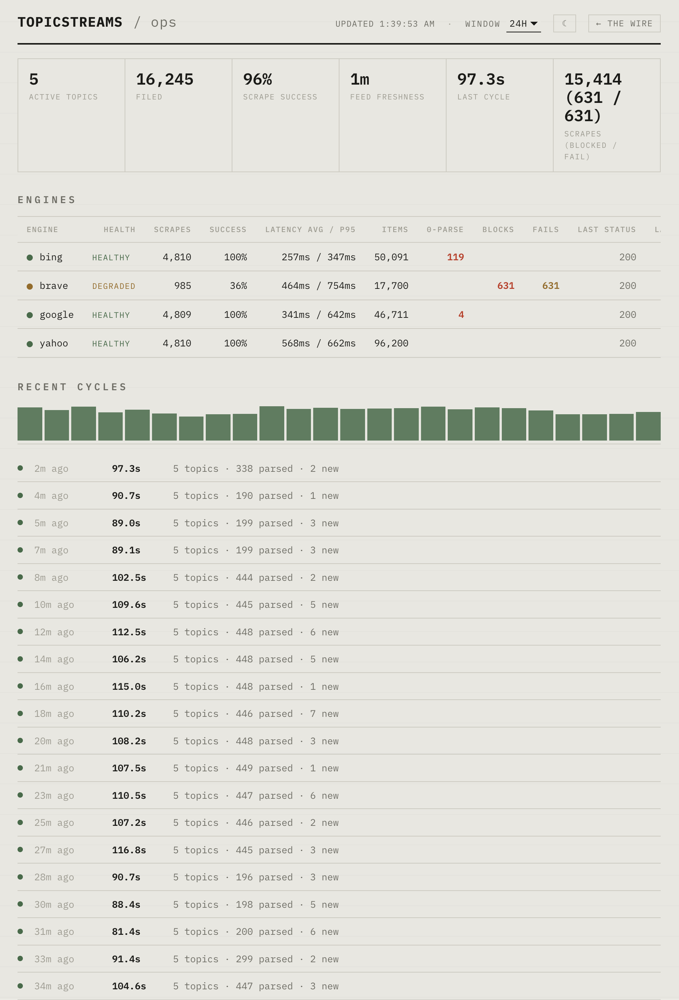

# TopicStreams

Real-time news aggregation system that continuously scrapes search engines (Google by default, with pluggable Bing/Yahoo/Brave backups) — the News tab, not Google News — for any topics (search keywords) and streams updates via WebSocket.

## Why TopicStreams?

### The Limitations with Google News & RSS

Google News ([https://news.google.com](https://news.google.com)) and Google News RSS (`https://news.google.com/rss?search=<keyword>`) provide curated news collections based on Google's algorithms. While convenient, they have limitations:

- Results are **not necessarily the latest** - articles may be hours or days old
- Google filters by **quality and relevance**, potentially missing breaking news
- No control over what Google considers "newsworthy"

<p align="center">
<br/>
<em>Google News Search result - hours or days old</em>
</p>

<p align="center">
<br/>
<em>Google News RSS - same as Google News search</em>
</p>

### TopicStreams' Approach

TopicStreams scrapes **search engines' News results** with time filters — Google
Search's News tab by default, plus Bing/Yahoo/Brave — giving you:

- **Real-time results** - All news the engine indexes, regardless of quality rating
- **Unfiltered access** - No curation, you decide what's relevant
- **Near-instant updates** - Scrape frequently enough and catch news as it breaks
- **Full control** - Customize topics (search keywords) and scrape intervals
- **Multiple engines** - Pluggable search sources (Google, Bing, Yahoo, Brave) with fallback/all/rotate strategies; see [Search Engines](docs/SCRAPING_BEHAVIOR.md#search-engines)

<p align="center">
<br/>
<em>Google Search News Tab - Latest, Unfiltered Results</em>
</p>

## Try It Live

**Experience TopicStreams in action**: [http://topicstreams.dongziyu.com](http://topicstreams.dongziyu.com)

### Quick Demo

```bash
# Add topics (ensure they exist)
curl -X POST http://topicstreams.dongziyu.com/api/v1/topics \
  -H "Content-Type: application/json" \
  -d '{"name": "Bitcoin"}'

# List all active topics (contain "bitcoin")
curl http://topicstreams.dongziyu.com/api/v1/topics | jq

# Get latest news for "Bitcoin"
curl http://topicstreams.dongziyu.com/api/v1/news/bitcoin?limit=5 | jq
```

### WebSocket Streaming

For real-time news updates, connect via WebSocket:

```bash
# Real-time WebSocket news stream for an existing topic
# (add the topic first via POST /api/v1/topics — the WS doesn't create topics)
websocat ws://topicstreams.dongziyu.com/api/v1/ws/news/china | jq
```

The WebSocket delivers live news updates as they're scraped, showing the same content you'd see by continuously refreshing Google's news search page.

<p align="center">
<br/>
<em>WebSocket Real-time News Stream - Live updates as articles are scraped</em>
</p>

### What TopicStreams Offers

- **Real-time news streaming** on customizable topics (any search keywords)
- **Self-hosted** - No third-party news API costs

### Limitations

- **Search-engine dependency** - Black box algorithms, no source control, variable indexing speed, geographic filtering (Google is the default engine; Bing/Yahoo/Brave have the same trade-off)
- **Inconsistent Results** - Same queries return different results based on IP, geolocation, browser, A/B testing
- **No Quality Control** - All news included, credible or not
- **Access Risks** - Engines may detect scraping and rate limit or block access; mitigations: [Anti-Bot Detection](docs/ANTI_BOT_DETECTION.md) and adaptive per-engine cooldown

## Features

- **Real-time News Aggregation** - Continuously scrapes search engines' News results (Google Search's News tab by default — not the Google News site — plus Bing/Yahoo/Brave) for the latest articles
- **Multi-Topic Tracking** - Monitor multiple news topics simultaneously with configurable scrape intervals
- **WebSocket Streaming** - Subscribe to live news updates per topic via WebSocket connections
- **REST API** - Manage topics and retrieve historical news entries through HTTP endpoints
- **Anti-Bot Detection** - Native Chromium with runtime-derived browser fingerprinting and automation-signal hardening (playwright-stealth is deliberately disabled — Google detects its JS patches) ([details](docs/ANTI_BOT_DETECTION.md))

## Architecture

TopicStreams consists of three main components:

```plaintext
┌─────────────────────────┐
│         Client          │
│ (REST API / WebSocket)  │
└────────────┬────────────┘
             │                               
             ▼                               
┌─────────────────────────┐    ┌──────────────────────────────┐
│     FastAPI Server      │    │      Scraper Service         │
│                         │    │                              │
│  - REST endpoints       │    │  - Per-engine parallel       │
│  - WebSocket streams    │    │    workers (Playwright)      │
│  - PostgreSQL listener  │    │  - BeautifulSoup parser      │
└────────────┬────────────┘    └─────────────┬────────────────┘
             │                               │
             ▼                               ▼
┌─────────────────────────────────────────────────────────────┐
│                   PostgreSQL Database                       │
│                                                             │
│          - Topics (tracked keywords)                        │
│          - News Entries (scraped articles)                  │
│          - Scraper Logs (monitoring)                        │
│          - LISTEN/NOTIFY for real-time updates              │
└─────────────────────────────────────────────────────────────┘
```

### Data Flow

1. **Scraper Service** runs one parallel worker per configured search engine (Google's News tab by default, plus Bing/Yahoo/Brave), each continuously sweeping the tracked topics at its own paced rate
2. New articles are inserted into **PostgreSQL** with automatic deduplication
3. Database triggers send **NOTIFY** events on new inserts
4. **FastAPI Server** listens for these events via PostgreSQL's LISTEN/NOTIFY
5. Updates are pushed to connected **WebSocket clients** in real-time
6. Clients can also fetch historical data via **REST API**

### Key Technologies

- **FastAPI** - Web framework for REST and WebSocket
- **Playwright** - Browser automation with anti-bot detection ([see how it works](docs/ANTI_BOT_DETECTION.md))
- **PostgreSQL** - Reliable storage with LISTEN/NOTIFY for real-time events
- **Docker** - Container orchestration for easy deployment

## Prerequisites

- **Docker** installed on your system
  - [Install Docker](https://docs.docker.com/get-docker/)

That's it! All dependencies (Python, PostgreSQL, Playwright browsers) are handled inside containers.

> **Optional:** Install [websocat](https://github.com/vi/websocat) for WebSocket testing (used for demo in this article), or use any WebSocket client you prefer.

## Web UI

TopicStreams ships a responsive Web UI styled as a **news wire desk** — a single live transmission feed indexed by time, in light or dark themes.

### Features

- **The Wire** - One chronological stream of all watched topics, newest first. Live entries arrive over WebSocket and prepend at the top; scrolling down loads earlier entries indefinitely (cursor pagination). Filter to a single topic or view all. A **↑ latest** button appears once you scroll down, jumping back to the live edge.
- **Auto-watched topics** - Every topic you track is watched automatically (no per-topic subscribe step). Topics show as removable slugs; add one from the same row.
- **Scrape-health indicator** - The masthead status reflects the real state of the scraper, derived from recent scraper logs: `live`, `degraded` (some feeds failing), `errors` (all feeds failing), `stalled` (no recent scrapes), `idle` (none yet), or `offline` (API unreachable). Hover it for detail.
- **Light / dark themes** - Toggle in the masthead; defaults to your system preference and is remembered across visits.

### Access the Web UI

After [Quick Start](#quick-start), simply open your browser and navigate to:

```plaintext
http://localhost:5000
```

> **Note:** By default, the Web UI is accessible on port 5000. If you changed `HOST_PORT` in your `.env` file (e.g., set to `80` for production), use that port instead (e.g., `http://localhost:80`).

<p align="center">

<br/>
<em>TopicStreams Web UI — "the wire": a live, time-indexed news transmission feed</em>
</p>

> **Scrape-health is server-computed** (`GET /api/v1/status`) from recent `scraper_logs`, refreshed every 30s. It detects selector rot: if Google changes its News-tab markup so scrapes return HTTP 200 but parse **0 entries** across the board, the masthead shows `no items` (state `parsing`) instead of silently reading `live`. A single topic with genuinely no news this hour is safe — it only trips when *every* recent scrape parses nothing.

### Monitor (ops) page

A built-in observability console at **`/monitor`** (linked from the wire masthead) gives a per-engine, per-cycle view of scraper health — no Prometheus/Grafana stack required, since the data already lives in Postgres. It polls [`GET /api/v1/metrics`](docs/API_REFERENCE.md#metrics) over a selectable window (1h / 6h / 24h) and shows:

- **Overall strip** - active topics, total filed, scrape success rate, feed freshness, last-cycle duration, and scrapes-in-window (blocked / failed).
- **Engines table** - one row per engine with a health label (`healthy` / `degraded` / `blocked` / `parsing` / `cooldown` / `idle`), success %, fetch latency (avg / p95), items parsed, 0-parse count (selector-rot signal), blocks (429/403/503), and last HTTP status. `blocked` now also covers connection-level teardowns with no HTTP status (e.g. Yahoo's `ERR_CONNECTION_CLOSED`).
- **Recent cycles** - a sparkline of per-cycle durations plus a list (duration, topics, parsed, new events).

A throttled engine shows up here rather than silently vanishing from the feed. When the scraper benches an engine, the table shows `cooldown` with a countdown to the next probe — so an engine that produces no scrapes while cooling stays visible instead of disappearing. See [Observability](docs/OBSERVABILITY.md) for details.

<p align="center">

<br/>
<em>The <code>/monitor</code> ops page — per-engine health, latency, and the recent-cycle timeline</em>
</p>

## Quick Start

### 1. Clone the Repository

```bash
git clone https://github.com/zydo/topicstreams.git
cd topicstreams
```

### 2. Start Services

Create your `.env` first — the stack fails fast with a clear message if it's missing:

```bash
cp .env.example .env
docker compose up -d
```

The defaults in `.env.example` work out-of-the-box; edit `.env` to customize ports, credentials, or the optional API auth token(s) (see [Authentication & Security](#authentication--security)). `config.yml` is created from its `.yml.example` template on first run, so you only need to copy it when you want to change scraper or API settings:

```bash
cp config.yml.example config.yml
```

This will start three containers:

- **postgres** - Database
- **scraper** - Background scraping service
- **api** - FastAPI server [http://localhost:5000](http://localhost:5000) (or port set by `HOST_PORT` in `.env`)

### 3. Add Topics to Track

```bash
# Add a topic (replace 5000 with your HOST_PORT if changed)
curl -X POST http://localhost:5000/api/v1/topics \
  -H "Content-Type: application/json" \
  -d '{"name": "artificial intelligence"}'
```

Scraping of the topic will start on the next iteration.

### 4. Access Real-Time News

**WebSocket (for real-time):**

```bash
# Using websocat
websocat ws://localhost:5000/api/v1/ws/news/artificial+intelligence

# Or with jq for prettier formatted output
websocat ws://localhost:5000/api/v1/ws/news/artificial+intelligence | jq
```

**REST API (for historical data):**

```bash
# Get the latest 5 news entries for a topic (newest first)
curl "http://localhost:5000/api/v1/news/artificial+intelligence?limit=5" | jq

# Page back to older entries with the cursor from the previous response
curl "http://localhost:5000/api/v1/news/artificial+intelligence?limit=5&before_id=104" | jq

# Latest 5 across all topics
curl "http://localhost:5000/api/v1/news?limit=5" | jq

# List all actively scraping topics
curl http://localhost:5000/api/v1/topics | jq

# List recent 10 scraper logs (each log represents one search-engine page load - typically up to 10 news entries)
curl http://localhost:5000/api/v1/logs?limit=10 | jq
```

See the [API Reference](#api-reference) section below for complete endpoint documentation.

### 5. Monitor Logs

```bash
# Background scraper logs
docker compose logs -f scraper

# FastAPI server logs
docker compose logs -f api
```

### Stop Services

```bash
docker compose down
```

## Configuration

For complete configuration documentation including environment variables, YAML files, and browser fingerprinting settings, see [Configuration](docs/CONFIGURATION.md).

**Quick links:**

- [**Environment variables**](docs/CONFIGURATION.md#environment-variables-env) - Database and API settings in .env
- [**Scraper settings**](docs/CONFIGURATION.md#scraper-settings-configyml) - scrape_interval, max_pages, engines, pacing, cooldown, saturation
- [**Anti-detection settings**](docs/CONFIGURATION.md#anti-detection-settings-configyml) - Browser fingerprinting and stealth strategies
- [**Reloading config**](docs/CONFIGURATION.md#reloading-configuration) - How to apply configuration changes

## Anti-Bot Detection

TopicStreams uses sophisticated techniques to make the scraper appear as a real human user, minimizing the risk of being blocked by Google.

For detailed information about anti-detection strategies (Playwright stealth, browser fingerprinting, random delays, etc.), see [Anti-Bot Detection Documentation](docs/ANTI_BOT_DETECTION.md).

**Quick Reference:**
- All anti-detection strategies are configurable via `config.yml` (auto-created from the template on first run)
- See [Configuration](docs/CONFIGURATION.md#anti-detection-settings-configyml) for YAML configuration details

## Scraping Behavior

For detailed information about scraping behavior, monitoring, and scaling strategies, see [Scraping Behavior](docs/SCRAPING_BEHAVIOR.md).

**Quick links:**

- [**Per-engine parallel workers**](docs/SCRAPING_BEHAVIOR.md#execution-model-one-worker-per-engine) - Each engine runs concurrently in its own worker; topics within an engine stay sequential and paced
- [**Proactive pacing vs. cooldown**](docs/SCRAPING_BEHAVIOR.md#proactive-pacing-vs-reactive-cooldown) - Per-engine pace floor is the primary throttle; cooldown is the reactive backstop
- [**Scrape interval**](docs/SCRAPING_BEHAVIOR.md#scrape-interval-behavior) - How scrape_interval sets each worker's sweep period
- [**Exit-IP saturation**](docs/SCRAPING_BEHAVIOR.md#exit-ip-saturation-signal) - When the signal says to scale out to another IP
- [**Monitoring**](docs/SCRAPING_BEHAVIOR.md#monitoring-scrape-performance) - Track scraper performance
- [**Proxy support**](docs/SCRAPING_BEHAVIOR.md#proxy-rotation) - Route the scraper through residential/mobile proxies (in practice required — Google blocks direct automated access to the News tab)

## Authentication & Security

> Ships a few **built-in controls** (optional Bearer-token auth on the REST API,
> per-IP rate limiting, CORS, WS that can't create topics); beyond them it assumes
> a localhost/LAN or behind-a-reverse-proxy deployment. See
> [Authentication & Security](docs/AUTHENTICATION_SECURITY.md) for what's covered
> and further hardening (JWT/OAuth2, Cloudflare).

### REST API authentication (Bearer token)

Auth is **off by default** (dev mode) — every endpoint is open. Once any token is
configured, **all** REST endpoints require an `Authorization: Bearer <token>`
header matching a valid token. (WebSocket connections are not yet authenticated.)

Valid tokens come from two sources, used together:

| Source | Where | Takes effect | Best for |
| --- | --- | --- | --- |
| **Env bootstrap** | `TOPICSTREAMS_API_KEY` in `.env` (comma-separated) | On container **recreate** | A break-glass/admin key that always works |
| **DB-backed keys** | `api_keys` table, managed via CLI | **Live**, within ~30s, no restart | Day-to-day keys you add/revoke per client |

**Generate a token** with the bundled helper (cryptographically strong, URL-safe):

```bash
python scripts/generate_api_key.py             # one token
python scripts/generate_api_key.py -n 3        # three, comma-separated
python scripts/generate_api_key.py --bytes 48  # stronger (more entropy)
```

**Option A — env bootstrap key** (`.env`). Survives DB loss and is the
recommended way to seed the first/admin token. Editing it needs a container
**recreate**:

```bash
# .env
TOPICSTREAMS_API_KEY=admin-tok

docker compose up -d api    # recreates the container with the new env
```

> `docker compose restart api` is **not** enough for `.env` changes: it's
> injected via `env_file` at container-creation time, so a plain restart keeps
> the old value. Use `up -d` (add `--force-recreate` if it reports "up to date").

**Option B — DB-backed keys (live, no restart).** Add/disable tokens with the
management CLI; the API picks them up within `api_key_cache_ttl_seconds`
(default 30s) — no restart:

```bash
# add a key (mints + prints a token; use --label to name it)
docker compose exec api python scripts/manage_api_keys.py add --label alice

# list keys (tokens are masked)
docker compose exec api python scripts/manage_api_keys.py list
```

### Accessing the API with a Bearer token

Once auth is on, pass the token in the `Authorization: Bearer <token>` header on
every REST request:

```bash
TOKEN=alice-tok   # an env bootstrap token or a DB-backed one

# List topics
curl -H "Authorization: Bearer $TOKEN" \
  http://localhost:5000/api/v1/topics | jq

# Add a topic
curl -X POST http://localhost:5000/api/v1/topics \
  -H "Authorization: Bearer $TOKEN" \
  -H "Content-Type: application/json" \
  -d '{"name": "artificial intelligence"}'

# Get latest news for a topic
curl -H "Authorization: Bearer $TOKEN" \
  "http://localhost:5000/api/v1/news/artificial+intelligence?limit=5" | jq

# Delete (stop tracking) a topic
curl -X DELETE \
  -H "Authorization: Bearer $TOKEN" \
  http://localhost:5000/api/v1/topics/artificial+intelligence
```

Without a valid token, protected requests return `401 Unauthorized`:

```json
{ "error": "UNAUTHORIZED", "message": "Invalid or missing API token", "status": "error" }
```

**Web UI:** when auth is on, the UI (and the `/monitor` page) prompts once for a
token, stores it in your browser (`localStorage`), and sends it on every request.

> **WebSocket** streams (`/api/v1/ws/...`) are **not** authenticated yet, so they
> take no token — see the caveat under [Accessing Real-Time News](#4-access-real-time-news).

### Managing tokens

**DB-backed keys (live — recommended for day-to-day).** Managed with
`scripts/manage_api_keys.py`; changes apply within `api_key_cache_ttl_seconds`
(default 30s) with **no restart**:

```bash
# inside the API container (shares the DB connection settings):
docker compose exec api python scripts/manage_api_keys.py add --label alice  # add + print a token
docker compose exec api python scripts/manage_api_keys.py list               # list (id, label, masked token, active)
docker compose exec api python scripts/manage_api_keys.py disable 3          # revoke key #3
docker compose exec api python scripts/manage_api_keys.py enable 3           # re-enable key #3
docker compose exec api python scripts/manage_api_keys.py delete 3           # remove key #3
```

- **Add / revoke** — `add` / `disable` (by id from `list`); effective within the
  cache TTL, no restart.
- **Rotate** — `add` a new key, move clients over, then `disable`/`delete` the old one.
- Hand a distinct key (with a `--label`) to each client so you can revoke one
  without disrupting the rest.

**Env bootstrap key (`TOPICSTREAMS_API_KEY`).** Comma-separated; an always-valid
fallback that's independent of the DB. Any change requires a container
**recreate** (`docker compose up -d api`) — a plain `docker compose restart api`
keeps the old value. Unset it (and have no active DB keys) to return to open dev
mode.

> The two sources are unioned: the env key is your break-glass/admin token (works
> even if the DB is empty or a brand-new key hasn't propagated yet), while DB keys
> are the live-manageable set. Tokens are stored in plaintext and there's no
> per-token usage audit yet — for stronger key management put the API behind a
> gateway (see further hardening below).

**Quick links:**

- [**Built-in controls**](docs/AUTHENTICATION_SECURITY.md#built-in-controls) - Bearer-token auth, rate limiting, CORS
- [**Not covered**](docs/AUTHENTICATION_SECURITY.md#not-covered-add-before-public-exposure) - Gaps to close before public exposure
- [**Further hardening**](docs/AUTHENTICATION_SECURITY.md#recommended-solutions-further-hardening) - JWT/OAuth2, edge rate limiting, Cloudflare

## WebSocket Scalability

> Real-time fanout already rides on **Postgres `LISTEN/NOTIFY`**, which works
> across multiple API replicas as-is — each replica listens and fans out to its
> own clients. The only multi-replica-unsafe piece is the in-process rate
> limiter. See [WebSocket Scalability](docs/WEBSOCKET_SCALABILITY.md).

**Quick links:**

- [**How fanout works**](docs/WEBSOCKET_SCALABILITY.md#how-fanout-works-today) - Scraper → Postgres NOTIFY → per-replica LISTEN → local clients
- [**Multiple replicas**](docs/WEBSOCKET_SCALABILITY.md#what-this-means-for-multiple-replicas) - Fanout already works; the rate limiter is the open item
- [**Scaling ceiling**](docs/WEBSOCKET_SCALABILITY.md#scaling-ceiling) - When (and only when) a Redis/Kafka bus would be warranted

## API Reference

For complete API documentation including all endpoints, request/response formats, and examples, see [API Reference](docs/API_REFERENCE.md).

**Quick links:**

- [**Topics**](docs/API_REFERENCE.md#topics) - List, add, and delete topics
- [**News**](docs/API_REFERENCE.md#news) - Get news entries for topics with pagination
- [**Logs**](docs/API_REFERENCE.md#logs) - View scraper logs
- [**WebSocket**](docs/API_REFERENCE.md#websocket) - Real-time news updates via WebSocket

## Database Access

For database access, common SQL queries, backup, and restore instructions, see [Database Access](docs/DATABASE_ACCESS.md).

**Quick links:**

- [**psql access**](docs/DATABASE_ACCESS.md#database-access-1) - Connect to PostgreSQL database
- [**Common queries**](docs/DATABASE_ACCESS.md#common-sql-queries) - Topics, news entries, scraper logs, and table sizes
- [**Backup & restore**](docs/DATABASE_ACCESS.md#backup-and-restore) - Database backup and restore procedures

## License

MIT
