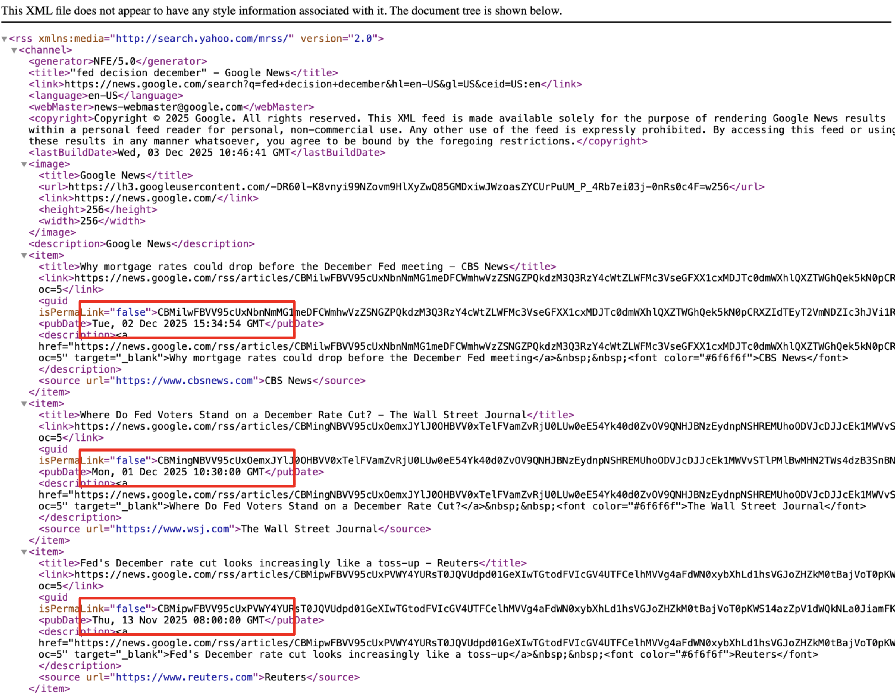
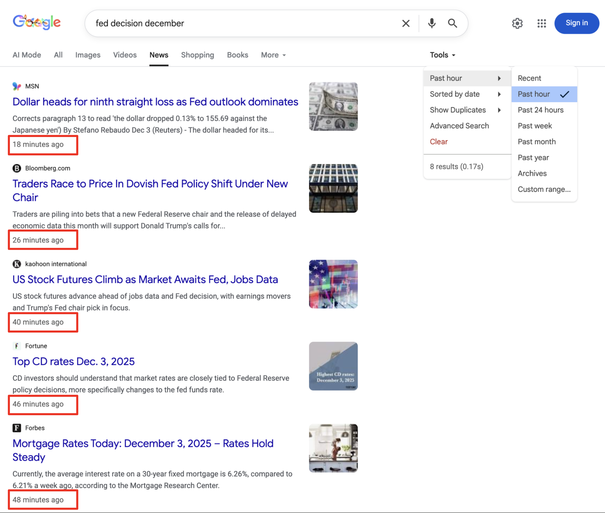
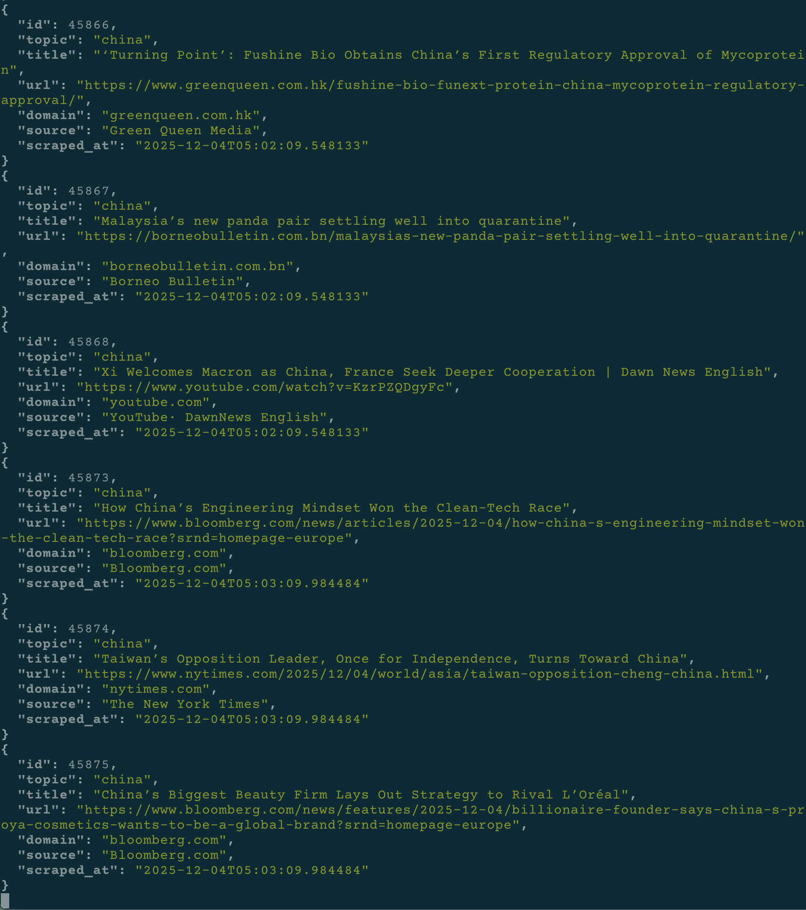
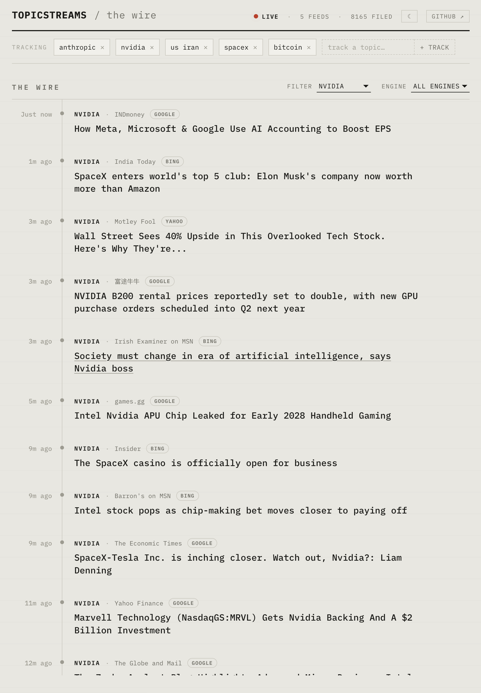

# TopicStreams

Real-time news aggregation system that continuously scrapes Google (not Google News) for any topics (search keywords) and streams updates via WebSocket.

## Why TopicStreams?

### The Limitations with Google News & RSS

Google News ([https://news.google.com](https://news.google.com)) and Google News RSS (`https://news.google.com/rss?search=<keyword>`) provide curated news collections based on Google's algorithms. While convenient, they have limitations:

- Results are **not necessarily the latest** - articles may be hours or days old
- Google filters by **quality and relevance**, potentially missing breaking news
- No control over what Google considers "newsworthy"

<p align="center">
<br/>
<em>Google News Search result - hours or days old</em>
</p>

<p align="center">
<br/>
<em>Google News RSS - same as Google News search</em>
</p>

### TopicStreams' Approach

TopicStreams scrapes **Google Search → News Tab** with time filters, giving you:

- **Real-time results** - All news indexed by Google, regardless of quality rating
- **Unfiltered access** - No curation, you decide what's relevant
- **Near-instant updates** - Scrape frequently enough and catch news as it breaks
- **Full control** - Customize topics (search keywords) and scrape intervals

<p align="center">
<br/>
<em>Google Search News Tab - Latest, Unfiltered Results</em>
</p>

## Try It Live

**Experience TopicStreams in action**: [http://topicstreams.dongziyu.com](http://topicstreams.dongziyu.com)

### Quick Demo

```bash
# Add topics (ensure they exist)
curl -X POST http://topicstreams.dongziyu.com/api/v1/topics \
  -H "Content-Type: application/json" \
  -d '{"name": "Bitcoin"}'

# List all active topics (contain "bitcoin")
curl http://topicstreams.dongziyu.com/api/v1/topics | jq

# Get latest news for "Bitcoin"
curl http://topicstreams.dongziyu.com/api/v1/news/bitcoin?limit=5 | jq
```

### WebSocket Streaming

For real-time news updates, connect via WebSocket:

```bash
# Real-time WebSocket news stream for "China" (automatically add topic if not present)
websocat ws://topicstreams.dongziyu.com/api/v1/ws/news/china | jq
```

The WebSocket delivers live news updates as they're scraped, showing the same content you'd see by continuously refreshing Google's news search page.

<p align="center">
<br/>
<em>WebSocket Real-time News Stream - Live updates as articles are scraped</em>
</p>

### What TopicStreams Offers

- **Real-time news streaming** on customizable topics (any search keywords)
- **Self-hosted** - No third-party news API costs

### Limitations

- **Google Dependency** - Black box algorithms, no source control, variable indexing speed, geographic filtering
- **Inconsistent Results** - Same queries return different results based on IP, geolocation, browser, A/B testing
- **No Quality Control** - All news included, credible or not
- **Access Risks** - Google may detect scraping and rate limit or block access, mitigation: [Anti-Bot Detection](docs/ANTI_BOT_DETECTION.md)

## Features

- **Real-time News Aggregation** - Continuously scrapes Google Search News tab (not Google News site) for the latest articles
- **Multi-Topic Tracking** - Monitor multiple news topics simultaneously with configurable scrape intervals
- **WebSocket Streaming** - Subscribe to live news updates per topic via WebSocket connections
- **REST API** - Manage topics and retrieve historical news entries through HTTP endpoints
- **Anti-Bot Detection** - Playwright with stealth patches, realistic browser fingerprinting, and configurable geolocation ([details](docs/ANTI_BOT_DETECTION.md))

## Architecture

TopicStreams consists of three main components:

```plaintext
┌─────────────────────────┐
│         Client          │
│ (REST API / WebSocket)  │
└────────────┬────────────┘
             │                               
             ▼                               
┌─────────────────────────┐    ┌──────────────────────────────┐
│     FastAPI Server      │    │      Scraper Service         │
│                         │    │                              │
│  - REST endpoints       │    │  - Playwright browser        │
│  - WebSocket streams    │    │  - BeautifulSoup parser      │
│  - PostgreSQL listener  │    │  - Continuous scraping loop  │
└────────────┬────────────┘    └─────────────┬────────────────┘
             │                               │
             ▼                               ▼
┌─────────────────────────────────────────────────────────────┐
│                   PostgreSQL Database                       │
│                                                             │
│          - Topics (tracked keywords)                        │
│          - News Entries (scraped articles)                  │
│          - Scraper Logs (monitoring)                        │
│          - LISTEN/NOTIFY for real-time updates              │
└─────────────────────────────────────────────────────────────┘
```

### Data Flow

1. **Scraper Service** continuously scrapes Google Search News tab for tracked topics
2. New articles are inserted into **PostgreSQL** with automatic deduplication
3. Database triggers send **NOTIFY** events on new inserts
4. **FastAPI Server** listens for these events via PostgreSQL's LISTEN/NOTIFY
5. Updates are pushed to connected **WebSocket clients** in real-time
6. Clients can also fetch historical data via **REST API**

### Key Technologies

- **FastAPI** - Web framework for REST and WebSocket
- **Playwright** - Browser automation with anti-bot detection ([see how it works](docs/ANTI_BOT_DETECTION.md))
- **PostgreSQL** - Reliable storage with LISTEN/NOTIFY for real-time events
- **Docker** - Container orchestration for easy deployment

## Prerequisites

- **Docker** installed on your system
  - [Install Docker](https://docs.docker.com/get-docker/)

That's it! All dependencies (Python, PostgreSQL, Playwright browsers) are handled inside containers.

> **Optional:** Install [websocat](https://github.com/vi/websocat) for WebSocket testing (used for demo in this article), or use any WebSocket client you prefer.

## Web UI

TopicStreams includes a modern, responsive Web UI that provides a complete dashboard for monitoring and managing your news aggregation system.

### Features

- **System Status Dashboard** - Real-time monitoring of scraper health and activity
- **Topic Management** - Easy add/remove topics with visual feedback
- **Real-time News Feed** - Live updates with WebSocket connections
- **Scraper Logs Panel** - Historical activity monitoring

### Access the Web UI

After [Quick Start](#quick-start), simply open your browser and navigate to:

```plaintext
http://localhost:5000
```

> **Note:** By default, the Web UI is accessible on port 5000. If you changed `HOST_PORT` in your `.env` file (e.g., set to `80` for production), use that port instead (e.g., `http://localhost:80`).

<p align="center">

<br/>
<em>TopicStreams Web UI - Complete dashboard for real-time news aggregation</em>
</p>

## Quick Start

### 1. Clone the Repository

```bash
git clone https://github.com/zydo/topicstreams.git
cd topicstreams
```

### 2. Configure Environment

Copy `.env.example` to `.env` and customize if needed:

```bash
cp .env.example .env
```

Default settings work out-of-the-box.

### 3. Start Services

```bash
docker compose up -d
```

This will start three containers:

- **postgres** - Database
- **scraper** - Background scraping service
- **api** - FastAPI server [http://localhost:5000](http://localhost:5000) (or port set by `HOST_PORT` in `.env`)

### 4. Add Topics to Track

```bash
# Add a topic (replace 5000 with your HOST_PORT if changed)
curl -X POST http://localhost:5000/api/v1/topics \
  -H "Content-Type: application/json" \
  -d '{"name": "artificial intelligence"}'
```

Scraping of the topic will start on the next iteration.

### 5. Access Real-Time News

**WebSocket (for real-time):**

```bash
# Using websocat
websocat ws://localhost:5000/api/v1/ws/news/artificial+intelligence

# Or with jq for prettier formatted output
websocat ws://localhost:5000/api/v1/ws/news/artificial+intelligence | jq
```

**REST API (for historical data):**

```bash
# Get recent news for a topic with pagination (result 11 to 15, newest first)
curl http://localhost:5000/api/v1/news/artificial+intelligence?offset=10&limit=5 | jq

# List all actively scraping topics
curl http://localhost:5000/api/v1/topics | jq

# List recent 10 scraper logs (each log represents one Google webpage load - typically up to 10 news entries)
curl http://localhost:5000/api/v1/logs?limit=10 | jq
```

See the [API Reference](#api-reference) section below for complete endpoint documentation.

### 6. Monitor Logs

```bash
# Background scraper logs
docker compose logs -f scraper

# FastAPI server logs
docker compose logs -f api
```

### Stop Services

```bash
docker compose down
```

## Configuration

TopicStreams uses two types of configuration files:
- `.env` file for database and API settings (via environment variables)
- YAML files in `config/` directory for scraper and anti-detection settings

Copy `.env.example` to `.env` to get started with default values.

### Environment Variables (.env)

#### Database Settings

| Variable            | Default    | Description                                                                                    |
| ------------------- | ---------- | ---------------------------------------------------------------------------------------------- |
| `POSTGRES_HOST`     | `postgres` | PostgreSQL hostname (use Docker service name, `postgres`, for Docker services internal access) |
| `POSTGRES_PORT`     | `5432`     | PostgreSQL port                                                                                |
| `POSTGRES_DB`       | `newsdb`   | Database name                                                                                  |
| `POSTGRES_USER`     | `newsuser` | Database username                                                                              |
| `POSTGRES_PASSWORD` | `newspass` | Database password                                                                              |

> **Note:** The PostgreSQL service is only accessible within the Docker network (not exposed to the host). Simple passwords are acceptable since the database is not publicly accessible. For direct database access, see [Database Access](#database-access).

#### API Settings

| Variable    | Default | Description                                                      |
| ----------- | ------- | ---------------------------------------------------------------- |
| `API_PORT`  | `5000`  | Port inside the container where FastAPI listens                  |
| `HOST_PORT` | `5000`  | Port exposed on the host (set to `80` for production deployment) |

> **Note:** The `HOST_PORT` is mapped to `API_PORT` (e.g., `HOST_PORT=80` and `API_PORT=5000` means the app listens on container port 5000 but is accessible via host port 80). For production deployments, set `HOST_PORT=80` to use the standard HTTP port.

### YAML Configuration Files

Scraper and anti-detection settings are configured via YAML files in the `config/` directory. These files are mounted into the containers at runtime and can be edited without rebuilding.

#### Scraper Settings (`config/scraper.yml`)

```yaml
scraper:
  scrape_interval: 60  # Seconds between scrape cycles
  max_pages: 1         # Maximum pages to scrape per topic
```

| Setting           | Default | Description                                                                                                                                                                                        |
| ----------------- | ------- | -------------------------------------------------------------------------------------------------------------------------------------------------------------------------------------------------- |
| `scrape_interval` | `60`    | Interval in seconds between scrape cycles (measured from start to start). Set to `0` or negative for continuous scraping with no delay. See [Scrape Interval Behavior](#scrape-interval-behavior). |
| `max_pages`       | `1`     | Number of result pages to scrape. Increase if you have high-volume topics or longer intervals.                                                                                                     |

#### Anti-Detection Settings (`config/anti_detection.yml`)

```yaml
anti_detection:
  playwright_stealth:
    enabled: true  # Apply playwright-stealth patches to hide automation

  browser_args:
    enabled: true
    args:
      - "--no-sandbox"
      - "--disable-setuid-sandbox"
      - "--disable-blink-features=AutomationControlled"

  random_delays:
    enabled: true
    min_seconds: 2   # Minimum delay between topics
    max_seconds: 5   # Maximum delay between topics

  randomized_order:
    enabled: true    # Shuffle topic order each cycle

  browser_fingerprint:
    enabled: true
    user_agent: "Mozilla/5.0 (Macintosh; Intel Mac OS X 10_15_7) ..."
    viewport_width: 1920
    viewport_height: 1080
    locale: "en-US"
    timezone_id: "America/Los_Angeles"     # Recommended to match server IP
    geolocation_latitude: 37.3273          # Recommended to match server IP
    geolocation_longitude: -121.954         # Recommended to match server IP
    color_scheme: "light"
    permissions:
      - "geolocation"

  captcha_detection:
    enabled: true
    keywords:
      - "captcha"
      - "unusual traffic"

  http_error_handling:
    enabled: true
    monitored_codes:
      - 429  # Rate limiting
      - 403  # Forbidden/blocked
      - 503  # Service unavailable

  http_headers:
    enabled: true
    headers:
      Accept: "text/html,application/xhtml+xml,application/xml;q=0.9,image/webp,*/*;q=0.8"
      Accept-Language: "en-US,en;q=0.9"
```

**Key Browser Fingerprinting Settings:**

| Setting                 | Default               | Description                                                                                                                                                                       |
| ---------------------- | --------------------- | --------------------------------------------------------------------------------------------------------------------------------------------------------------------------------- |
| `timezone_id`          | `America/Los_Angeles` | Browser timezone identifier. Recommended to match your server's IP location. [List of timezones](https://en.wikipedia.org/wiki/List_of_tz_database_time_zones) |
| `geolocation_latitude`  | `37.3273`             | Latitude coordinate (default: San Jose, CA)                                                                                                                                       |
| `geolocation_longitude` | `-121.954`            | Longitude coordinate (default: San Jose, CA)                                                                                                                                      |

**Example Location Configurations:**

```yaml
# New York
timezone_id: America/New_York
geolocation_latitude: 40.7128
geolocation_longitude: -74.0060

# London
timezone_id: Europe/London
geolocation_latitude: 51.5074
geolocation_longitude: -0.1278

# Tokyo
timezone_id: Asia/Tokyo
geolocation_latitude: 35.6762
geolocation_longitude: 139.6503
```

### Reloading Configuration

After editing YAML configuration files, restart the scraper to apply changes:

```bash
docker compose restart scraper
```

## Anti-Bot Detection

TopicStreams uses sophisticated techniques to make the scraper appear as a real human user, minimizing the risk of being blocked by Google.

For detailed information about anti-detection strategies (Playwright stealth, browser fingerprinting, random delays, etc.), see [Anti-Bot Detection Documentation](docs/ANTI_BOT_DETECTION.md).

**Quick Reference:**
- All anti-detection strategies are configurable via `config/anti_detection.yml`
- See [YAML Configuration Files](#yaml-configuration-files) for details

## Scraping Behavior

For detailed information about scraping behavior, monitoring, and scaling strategies, see [Scraping Behavior](docs/SCRAPING_BEHAVIOR.md).

**Quick links:**

- [**Sequential execution**](docs/SCRAPING_BEHAVIOR.md#sequential-execution) - How topics are scraped one after another
- [**Scrape interval**](docs/SCRAPING_BEHAVIOR.md#scrape-interval-behavior) - How scrape_interval controls timing
- [**Monitoring**](docs/SCRAPING_BEHAVIOR.md#monitoring-scrape-performance) - Track scraper performance
- [**Proxy rotation**](docs/SCRAPING_BEHAVIOR.md#proxy-rotation) - Scaling strategies for high-volume scraping *(not implemented yet)*

## Authentication & Security

> **Not implemented yet** - For security recommendations and implementation strategies, see [Authentication & Security](docs/AUTHENTICATION_SECURITY.md).

**Quick links:**

- [**Current state**](docs/AUTHENTICATION_SECURITY.md#current-state-localhostlan-only) - Localhost/LAN only, no built-in security
- [**Authentication**](docs/AUTHENTICATION_SECURITY.md#1-authentication--authorization) - API keys, JWT, OAuth2 options
- [**Rate limiting**](docs/AUTHENTICATION_SECURITY.md#2-api-rate-limiting) - Protect against abuse and DDOS
- [**Cloudflare**](docs/AUTHENTICATION_SECURITY.md#3-cloudflare-recommended-for-public-deployment) - Recommended for public deployment

## WebSocket Scalability

> **Not implemented yet** - For scalability recommendations and implementation strategies, see [WebSocket Scalability](docs/WEBSOCKET_SCALABILITY.md).

**Quick links:**

- [**Current state**](docs/WEBSOCKET_SCALABILITY.md#current-state-simple-broadcasting) - Simple in-memory broadcasting
- [**Limitations**](docs/WEBSOCKET_SCALABILITY.md#scalability-limitations) - O(n) broadcast cost, single point of failure
- [**Redis Pub/Sub**](docs/WEBSOCKET_SCALABILITY.md#1-redis-pubsub) - Horizontal scaling with O(1) publish cost
- [**Apache Kafka**](docs/WEBSOCKET_SCALABILITY.md#2-apache-kafka) - For very large-scale deployments (10K+ subscribers)

## API Reference

For complete API documentation including all endpoints, request/response formats, and examples, see [API Reference](docs/API_REFERENCE.md).

**Quick links:**

- [**Topics**](docs/API_REFERENCE.md#topics) - List, add, and delete topics
- [**News**](docs/API_REFERENCE.md#news) - Get news entries for topics with pagination
- [**Logs**](docs/API_REFERENCE.md#logs) - View scraper logs
- [**WebSocket**](docs/API_REFERENCE.md#websocket) - Real-time news updates via WebSocket


## Database Access

For database access, common SQL queries, backup, and restore instructions, see [Database Access](docs/DATABASE_ACCESS.md).

**Quick links:**

- [**psql access**](docs/DATABASE_ACCESS.md#database-access-1) - Connect to PostgreSQL database
- [**Common queries**](docs/DATABASE_ACCESS.md#common-sql-queries) - Topics, news entries, scraper logs, and table sizes
- [**Backup & restore**](docs/DATABASE_ACCESS.md#backup-and-restore) - Database backup and restore procedures

## License

MIT
